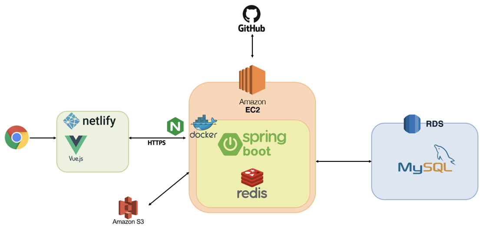

# 🏔️ Solo&Co: 혼자서도, 함께여서도 즐거운 AI 협업 여행 플래너

Solo&Co는 개인 여행의 자유로움과 단체 여행의 협업 효율성을 결합한 스마트 여행 플래닝 플랫폼입니다. AI를 통한 일정 자동 생성부터, 친구들과 함께 실시간으로 일정을 짜고 투표하는 기능까지, 여행의 시작인 '계획' 단계에서의 번거로움을 해결합니다.

---

## 🏛️ 시스템 아키텍처



---

## 🛠️ 기술 스택

| Category          | Technology                                 |
| :---------------- | :----------------------------------------- |
| **Language**      | Java 17                                    |
| **Framework**     | Spring Boot 3.5.7                          |
| **Database**      | MySQL, MyBatis                             |
| **Caching**       | Redis (Data Redis)                         |
| **Security**      | Spring Security, JWT (Asymmetric - RSA)    |
| **AI**            | Spring AI, OpenAI GPT-4o-mini              |
| **Storage**       | AWS S3 SDK                                 |
| **Documentation** | SpringDoc OpenAPI (Swagger)                |
| **Test**          | k6 (Performance/Concurrency Test), JUnit 5 |

---

## 🚀 주요 기능

- **LLM & 위치 기반 장소 큐레이션** : Google Places API를 활용한 혼밥/1인 특화 장소 정밀 추천
- **실시간 일정 공동 편집** : WebSocket 기반 일정 동기화로 그룹 멤버 간 실시간 계획 수립 가능
- **지능형 경로 최적화** : 다수 방문지에 대해 효율적인 동선을 자동으로 생성하는 최적화 알고리즘 적용
- **협업 의사결정 시스템** : 방문지 선정을 위한 실시간 투표 서비스 및 결과 시각화

---

## 👨‍💻 담당 역할 (백엔드 개발)

- **백엔드 전체 아키텍처 설계 및 구축** : 서비스 확장성을 고려한 RESTful API 설계 및 DB 모델링(MySQL) 전담
- **보안 및 인증 인프라 구축** : JWT(Access/Refresh Token) 기반 인증 체계와 Redis를 활용한 토큰 관리 시스템 구현
- **외부 시스템 장애 격리** : WebClient 기반 Non-blocking I/O 전환으로 외부 API 지연 시 스레드 차단(Blocking)을 방지하고, 장애 전파를 막아 서비스 가용성(Availability) 확보
- **실시간 데이터 동기화 엔진 개발** : STOMP 프로토콜을 활용한 대규모 실시간 일정 업데이트 브로드캐스팅 로직 구축
- **병목 현상 개선 및 성능 검증** : k6 부하 테스트를 통해 DB 동시성(Race Condition) 오류 및 성능 병목 지점을 탐지하고 최적화 수행
- **API 표준화 및 미디어 최적화** : S3 기반 이미지 처리 최적화, Swagger 문서화, 공통 예외 처리 시스템 구축으로 개발 효율 극대화

---

## 💎 기술적 고찰

### 🛡️ 비대칭 키(RSA) 기반 JWT 인증
단순 대칭키 방식을 넘어 공개키/개인키 구조를 도입하여 토큰 검증의 안전성을 높이고, 보안 사고 발생 시 서버 리스타트 없이도 대응할 수 있는 구조를 설계했습니다.

### ⚡ 동시성 제어 및 데이터 정합성
실시간 투표와 일정 수정이 빈번한 환경에서 발생할 수 있는 Race Condition 이슈를 해결하기 위해 DB 락(Lock) 전략을 적용하고, 이를 `k6`와 같은 스트레스 테스트 도구로 검증하여 데이터 무결성을 보장했습니다.

---

## 📂 데이터베이스 설계 (ERD)

핵심 도메인은 다음과 같이 유기적으로 연결됩니다.

- **User**: 사용자 정보 및 권한 관리
- **Travel Project**: 협업의 중심 단위 (멤버, 초대 관리)
- **Itinerary (Solo/Group)**: AI 생성 및 직접 수정한 날짜별 일정 데이터
- **Project Post & Vote**: 공유 및 의사결정을 위한 커뮤니티 데이터

---

## 📦 시작하기

### 사전 요구 사항
- Java 17
- MySQL 8.x
- Redis
- OpenAI API Key & Google Places API Key

### 설정 방법
`src/main/resources/application.properties`에 필요한 환경 변수를 설정하세요.

```properties
spring.ai.openai.api-key=${OPENAI_API_KEY}
google.places.api.key=${GOOGLE_PLACES_API_KEY}
# AWS, JWT, Redis 등 관련 설정 추가
```

### 설치 및 실행
```bash
# 저장소 클론
git clone https://github.com/taejeongH/solo-co.git

# 빌드 및 실행
./mvnw spring-boot:run
```
