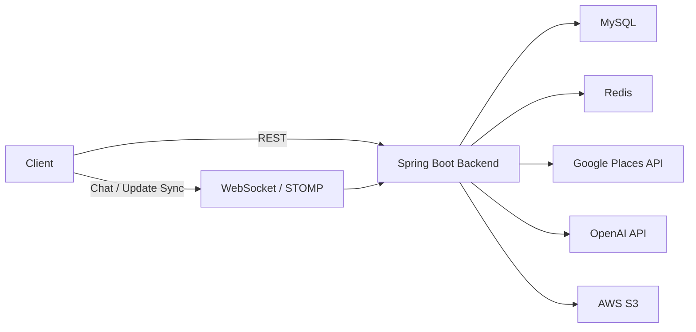

# 🧳 Solo&Co

LLM 추천, 위치 기반 동선 생성, 실시간 협업 기능을 결합한 여행 일정 생성 서비스

<br>

## 📚 목차

1. [프로젝트 소개](#-1-프로젝트-소개)
2. [주요 기능](#-2-주요-기능)
3. [시스템 아키텍처](#️-3-시스템-아키텍처)
4. [프로젝트 구조](#-4-프로젝트-구조)
5. [핵심 설계](#-5-핵심-설계)
6. [기술 스택](#️-6-기술-스택)
7. [트러블 슈팅](#-7-트러블-슈팅)
8. [회고](#-8-회고)

<br>

## 📖 1. 프로젝트 소개

### 프로젝트 기간

* 2025.11 ~ 2026.02

### 배경

* 여행 일정 계획은 장소 탐색, 동선 구성, 동행자와의 의견 조율이 분리되어 있어 준비 시간이 길어지는 문제가 있었습니다.
* 특히 그룹 여행은 일정 변경 공유와 여행지 후보 결정이 여러 채널로 나뉘어 비효율적이었습니다.

### 목표

* 선택 장소 기반 동선 자동 생성과 AI 코스 후보 추천 기능을 구현합니다.
* 그룹 여행에서 일정 변경, 채팅, 투표를 실시간으로 공유할 수 있는 협업 구조를 제공합니다.
* 외부 API 연동과 실시간 이벤트 전파가 함께 존재하는 구조에서 기본적인 응답성과 일관성을 확보합니다.

<br>

## ✨ 2. 주요 기능

| 기능 | 설명 |
| ---- | ---- |
| AI 여행 코스 후보 생성 | 여행 기간과 선택 장소 정보를 기반으로 개인·그룹 여행 코스 후보 생성 |
| 여행 동선 자동 생성 | 선택된 장소를 `Nearest Neighbor` 방식으로 정렬해 기본 여행 동선 자동 구성 |
| 실시간 그룹 협업 | 일정 변경 이벤트와 채팅 메시지를 그룹 단위 채널로 실시간 브로드캐스트 |
| 커뮤니티/투표 | 게시글, 이미지, 태그, 댓글, 투표 기능을 통해 그룹 의사결정 지원 |

<br>

## 🏗️ 3. 시스템 아키텍처

### 전체 구조

* 클라이언트는 REST API와 WebSocket(STOMP)을 통해 백엔드와 통신합니다.
* 백엔드는 Spring Boot 기반으로 인증, 여행 프로젝트, 일정, 커뮤니티, 장소 조회 기능을 제공합니다.
* 데이터는 MySQL에 저장되며, Redis는 AI 결과와 사진 키 캐시에 사용됩니다.
* 외부 서비스로 Google Places API, OpenAI API, AWS S3를 연동합니다.
* 장소 사진은 S3에 업로드한 뒤 Presigned URL로 제공합니다.



### 주요 흐름

1. 사용자가 여행 프로젝트, 장소, 일정 생성 또는 커뮤니티 기능을 요청합니다.
2. 서버가 JWT 인증 및 프로젝트 멤버 권한을 검증합니다.
3. 일정 생성 요청의 경우 기본 동선을 계산하고, 필요 시 AI 및 외부 장소 API를 호출합니다.
4. 처리 결과를 DB, Redis, S3에 반영하고, 일정 변경 시 WebSocket으로 그룹 참여자에게 이벤트를 전파합니다.
5. 최종 결과를 REST 응답 또는 실시간 메시지로 사용자에게 전달합니다.

<br>

## 📁 4. 프로젝트 구조

```text
project-root
├── src
│   ├── main
│   │   ├── java
│   │   │   └── com.ssafy
│   │   │       ├── ai
│   │   │       ├── auth
│   │   │       ├── config
│   │   │       ├── global
│   │   │       ├── place
│   │   │       ├── redis
│   │   │       ├── travel
│   │   │       ├── user
│   │   │       └── SoloCoApplication.java
│   │   └── resources
│   │       ├── application.properties
│   │       ├── application-local.properties
│   │       ├── application-prod.properties
│   │       ├── db
│   │       └── mappers
│   └── test
├── docs
├── k6-tests
├── docker-compose.yml
├── docker-compose.local.yml
├── docker-compose.prod.yml
├── Dockerfile
└── README.md
```

### 구조 설명

| 디렉토리 | 설명 |
| -------- | ---- |
| `ai` | OpenAI 연동, 프롬프트 빌더, AI 응답 처리 |
| `auth` | 로그인, 회원가입, 토큰 발급 등 인증 관련 로직 |
| `config` | WebClient, Security, Redis, WebSocket 등 전역 설정 |
| `global` | 공통 예외 처리, JWT 필터, S3 서비스 등 공통 모듈 |
| `place` | Google Places 기반 장소 검색 및 상세 조회 |
| `redis` | AI 결과 및 사진 키 캐시 처리 |
| `travel` | 여행 프로젝트, 일정, 장소, 커뮤니티, WebSocket 이벤트 등 핵심 도메인 |
| `user` | 사용자 조회/수정 기능 |
| `k6-tests` | 성능 및 동시성 테스트 스크립트 |
| `docs` | 아키텍처 이미지 등 프로젝트 문서 리소스 |

<br>

## 🧩 5. 핵심 설계

### 5-1. 경로 계산과 AI 추천의 역할 분리

* 일정 생성 시 기본 동선은 `ItineraryAlgorithmService`에서 계산하고, AI는 코스 후보 보정과 새 장소 제안 역할에 한정했습니다.
* 경로 계산까지 전부 LLM에 맡기면 응답 시간이 길고 결과 검증이 어려워질 수 있어, 결정론적 로직과 비정형 추천 로직을 분리했습니다.
* 이를 통해 기본 동선 생성은 빠르게 처리하고, AI는 사용자 경험을 확장하는 역할로 활용할 수 있도록 설계했습니다.

### 5-2. 외부 장소 API 비동기 호출 구조

* 장소 검색, 상세 조회, 사진 조회는 Google Places API를 사용하며 `WebClient` 기반 비동기 호출로 처리합니다.
* 일정 생성 과정에서 AI가 새 장소를 제안한 경우, 해당 장소를 다시 Google Places API로 조회해 실제 장소 정보로 보강합니다.
* AI 결과와 사진 키는 Redis에 저장해 반복 호출 비용을 줄이고 재사용성을 높였습니다.

### 5-3. 실시간 협업 및 데이터 정합성 처리

* 일정 변경 이벤트와 채팅 메시지는 WebSocket(STOMP) 채널을 통해 그룹 단위로 브로드캐스트합니다.
* 주요 쓰기 로직은 서비스 계층의 `@Transactional` 경계 안에서 처리합니다.
* 커뮤니티 투표는 `project_post_vote_result` 테이블의 `(vote_id, user_id)` 유니크 제약으로 중복 투표를 방지합니다.
* 게시글/댓글 수정·삭제는 작성자 권한 검증을 거치고, 프로젝트 접근은 멤버 여부를 기준으로 제한합니다.

<br>

## 🛠️ 6. 기술 스택

### 기술 배지

**Backend**  


**Database / Cache**  


**Realtime / API**  


**Infra / Monitoring**  


### 기술 선택 이유

| 기술 | 선택 이유 |
| ---- | --------- |
| Spring Boot | 인증, 일정, 커뮤니티, 외부 API 연동을 하나의 서버 애플리케이션으로 빠르게 구성하기 위해 선택 |
| WebClient | Google Places API 호출 시 blocking 대기를 줄이고 비동기 처리 구조를 적용하기 위해 선택 |
| Redis | AI 결과와 장소 사진 키를 임시 캐시해 반복 호출 비용을 줄이기 위해 사용 |
| MySQL + MyBatis | 여행/커뮤니티 도메인의 관계형 데이터와 SQL 제어를 명확하게 관리하기 위해 사용 |
| WebSocket + STOMP | 그룹 일정 동기화와 채팅 메시지를 실시간 브로드캐스트하기 위해 사용 |
| OpenAI API | 여행 코스 후보 생성과 개인/그룹 맥락 기반 추천을 위해 사용 |
| Google Places API | 장소 검색, 상세 정보, 좌표 기반 장소 보강 기능을 위해 사용 |

<br>

## 🔥 7. 트러블 슈팅

### 7-1. 대규모 동시 투표 시 발생하는 중복 참여 및 데이터 정합성 문제 해결

#### Problem

* 동시 투표 요청 시 `조회 → 판단 → 삽입` 과정이 겹치며 동일 사용자의 중복 투표가 발생했습니다.
* 중복 저장된 데이터로 인해 단일 투표 조회 시 서버 500 오류가 발생했습니다.

#### Action

* `(vote_id, user_id)` 복합 유니크 키를 적용해 DB 레벨에서 중복 투표를 차단했습니다.
* `DuplicateKeyException` 발생 시 500 대신 `409 Conflict`를 반환하도록 예외 처리 로직을 개선했습니다.

#### Result

* 동시 요청 환경에서도 중복 투표 0건을 유지할 수 있었습니다.
* 투표 데이터 정합성을 확보했고, 오류 응답 구조를 예측 가능하게 정리했습니다.

### 7-2. 비동기 Non-blocking API 리팩토링을 통한 시스템 가용성 및 성능 최적화

#### Problem

* 외부 API 응답 지연 시 서버 스레드가 장시간 점유되어 동시 요청 처리 성능이 저하됐습니다.
* 비동기 전환 과정에서 인증 정보 전파가 누락되어 정상 요청에서도 간헐적으로 403 오류가 발생했습니다.

#### Action

* 외부 API 호출을 `WebClient` 기반 Non-blocking 구조로 전환했습니다.
* `thenCompose` / `thenApply` 체이닝으로 기존 동기 흐름을 비동기 처리에 맞게 리팩토링했습니다.
* 비동기 실행 흐름에서도 인증 정보가 유지되도록 필터 동작을 개선했습니다.

#### Result

* 외부 API 지연 상황에서도 서비스 가용성을 더 안정적으로 유지할 수 있었습니다.
* 스레드 점유를 줄였고, 비동기 흐름에서 발생하던 인증 오류를 제거해 요청 처리 안정성을 높였습니다.

<br>

## 📝 8. 회고

### 잘한 점

* 경로 생성, AI 추천, 외부 장소 API, 실시간 협업 기능을 하나의 프로젝트 흐름으로 통합했습니다.
* 경로 계산과 추천을 분리해 결정론적 로직과 비정형 추천 로직의 역할을 나누는 구조를 경험했습니다.
* WebSocket 기반 실시간 동기화와 커뮤니티/투표 기능까지 포함해 개인 여행뿐 아니라 그룹 협업 시나리오를 확장했습니다.

### 아쉬운 점

* 현재 동선 생성은 직선거리 기반 `Nearest Neighbor`라 실제 도로망, 교통 상황, 이동 수단을 반영하지 못합니다.
* WebSocket 연결 및 구독 단계의 인증/인가가 충분히 보강되지 않았습니다.
* 댓글은 구현되어 있지만 대댓글 구조, 변경 이력 저장, 세밀한 협업 권한 모델은 반영하지 못했습니다.

### 다음 개선 방향

* 직선거리 대신 도로 기반 이동 시간 데이터를 반영한 비용 함수로 경로 품질을 개선합니다.
* WebSocket handshake 단계 JWT 인증과 프로젝트 멤버 기반 구독/발행 인가를 추가합니다.
* 추천 결과를 경로에 재검증·재정렬하는 후처리 구조를 도입해 코스 품질을 보완합니다.
* 트러블 슈팅, 성능 테스트 결과, 운영 관점 개선 사항을 README에 추가 정리합니다.
